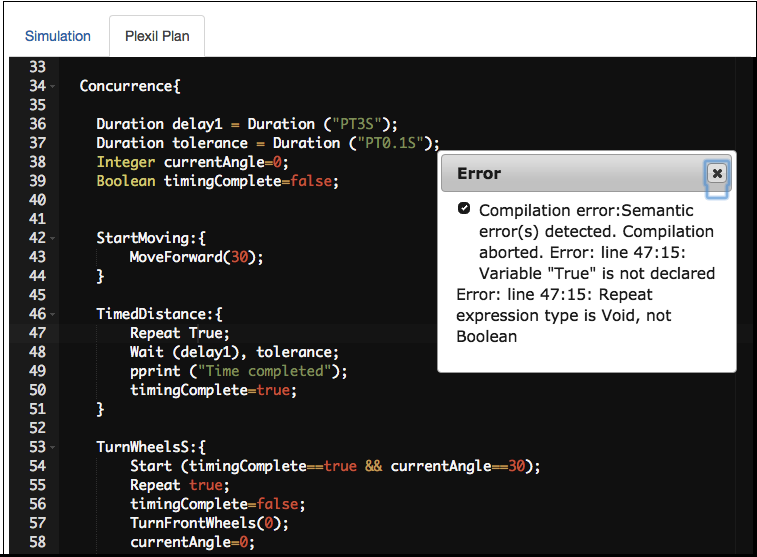
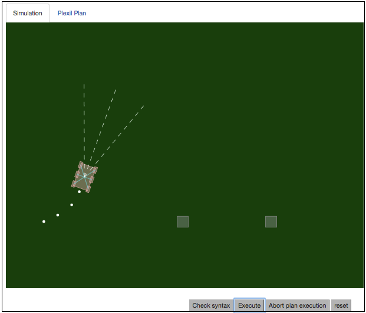
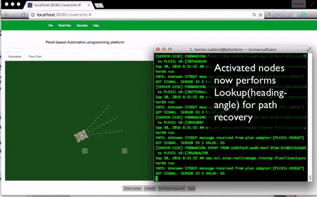

### A  Web-based development  and  simulation  environment for PLEXIL-based automation plans

The simulation environment was created for the RS-232 control firmware of the six-wheel rover described in [this paper](https://www.researchgate.net/publication/312485885_Hardware_and_software_architecture_for_Plexil-based_simulation_supported_robot_automation). It works with with the same code used in the physical rover performing control tasks (actions + events handling) using an abtraction layer that allow switching from a RS-232(GPIO) interface -for the physical rover- to a WebSockets one -for the simulator-.

This environment servers two purposes: on the one hand, evaluating the control software itself (PLEXIL + a custom plexil adapter), and on the other, designing plexil plans tailored to the designed rover.

#### Online Editor and compiler

#### Online simulator

This project requires a working copy of [PLEXIL 4.0.1](https://sourceforge.net/projects/plexil/files/latest/download) installed and configured in the server, with the PLEXIL adapter

The SoC code used to run the plan in the physical rover (the six-wheel rover with a command-based RS-232 interface described in the paper), is available at https://bitbucket.org/hcadavid/soc-plexil-hardware-adapter/src/master/
